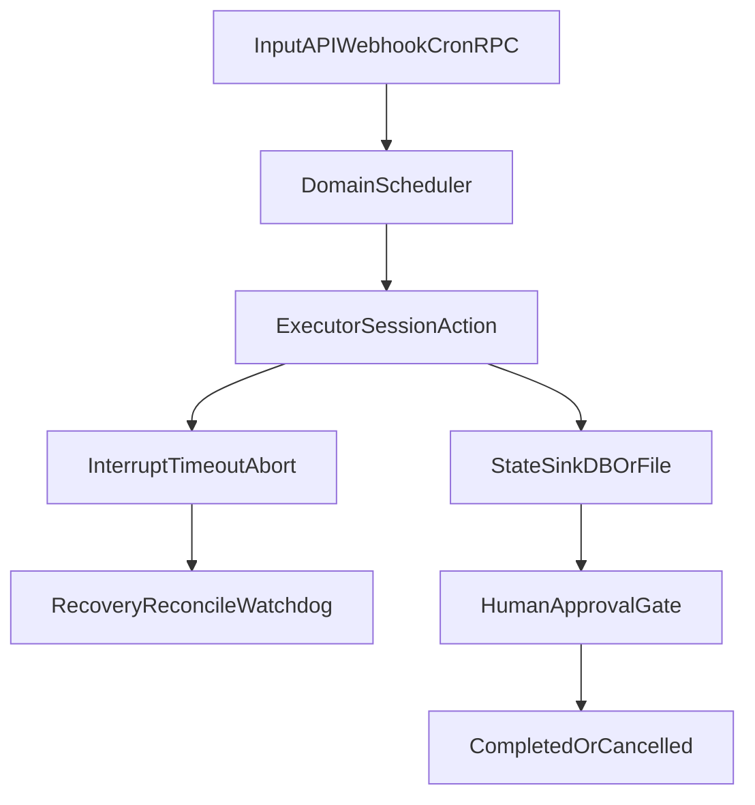

# Suna 核心机制速览（Runtime/调度/回写/恢复/HITL）

本文用于快速建立对 Suna 核心运行机制的“可定位”认知：每条结论都能映射到具体代码路径。

## 1. Runtime 主机制（入口 + 生命周期）

### 1.1 主入口与主循环

- 进程入口在 `core/kortix-master/src/index.ts`，由 Bun 导出 `fetch/websocket` 处理 HTTP、SSE、WS。
- 运行形态是“事件驱动 + 后台守护”：
  - 事件驱动：请求进入路由后分流到 tasks/triggers/proxy 等域。
  - 后台守护：`serviceManager.start()` 启动后开启 watchdog 定时巡检。

关键定位：

- `core/kortix-master/src/index.ts`
- `core/kortix-master/src/services/service-manager.ts`

### 1.2 服务生命周期与自愈

- `ServiceManager` 管理系统服务（`spawn`/`s6` 两种 adapter）。
- `runWatchdog()` 周期检查健康状态；不健康会 `requestRecovery()`。
- 恢复具备两个保护：
  - `recoveryInFlight`：同服务恢复合并，避免并发恢复风暴。
  - `RECOVERY_THROTTLE_MS`：恢复节流，避免抖动。

关键定位：

- `core/kortix-master/src/services/service-manager.ts`
  - `startWatchdog()`
  - `runWatchdog()`
  - `requestRecovery()`

## 2. 指令接收 -> 调度 -> 执行 -> 状态回写

系统并非单一入口，而是多条“域内闭环”并行存在。

### 2.1 Task 链路（项目任务）

1. 接收

- `POST /kortix/tasks/:id/start` 在 `core/kortix-master/src/routes/tasks.ts`。

2. 调度

- `startTask()` 在 `core/kortix-master/src/services/task-service.ts`：
  - 先创建 `task_runs`；
  - 优先尝试复用已有 `owner_session_id` 继续执行；
  - 失败则新建 worker session 并下发 prompt。

3. 执行

- 调用 OpenCode SDK：
  - `client.session.create(...)`
  - `client.session.promptAsync(...)`

4. 回写

- 任务域状态写入 SQLite：
  - `tasks`（任务当前态）
  - `task_runs`（运行态）
  - `task_events`（事件流）
- 关键函数：`updateTaskRun()`、`recordTaskEvent()`、`syncTaskFromLatestRun()`。

### 2.2 Queue 链路（会话消息排队）

1. 接收

- 入队 API 在 `apps/api/src/queue/routes.ts`（如 `POST /sessions/:sessionId`）。

2. 调度

- 后台 `startDrainer()` 周期轮询（2s）在 `apps/api/src/queue/drainer.ts`。
- 仅当 session idle 时出队，且有 settle/recheck 防抖。

3. 执行

- `sendPrompt()` 调 `POST /session/:id/prompt_async`。

4. 回写

- 队列落盘到 `.kortix-data/queue/*.json`（`apps/api/src/queue/storage.ts`）。
- 发送失败时回插队首（`setSessionQueue([msg, ...current])`）。

### 2.3 Trigger 链路（Cron/Webhook 事件）

1. 接收

- 管理入口在 `core/kortix-master/src/routes/triggers.ts`。
- Webhook/Cron 运行在 triggers 子系统。

2. 调度

- `TriggerManager.start()` 启动后：
  - YAML -> DB 同步；
  - `rebuildRuntime()` 重建 cron job 与 webhook route。
- 真正分发在 `ActionDispatcher.dispatch()`。

3. 执行

- `executeAction()` 按 `action_type` 分支：
  - `prompt`
  - `command`
  - `http`

4. 回写

- execution 记录写入 `trigger_executions`（由 `TriggerStore`）。
- `markRun()` 更新 `last_run_at/next_run_at/session_id`。
- 并发防重：同 trigger 正在跑时记 `skipped` execution。

### 2.4 Tunnel RPC 链路（远程能力调用）

1. 接收

- `apps/api/src/tunnel/routes/rpc.ts` 接收 RPC 请求。

2. 调度

- 方法能力映射 + 权限校验后转发 relay。

3. 执行

- `tunnelRelay.relayRPC(...)` 转发到连接 agent。

4. 回写

- 审计日志、连接状态、事件通知由 tunnel 模块写回 DB/事件流。

## 3. 中断、恢复、重试能力

### 3.1 中断与超时

- Task 取消：`cancelTask()` 会尝试 `session.abort()`，并将任务状态置为 `cancelled`。
- Proxy 超时：
  - 普通请求 30s 超时；
  - SSE 客户端断开会中断上游；
  - 非 SSE 超时时触发 `requestRecovery('opencode-serve', ...)`。
- Trigger 动作超时：
  - command action 支持 `timeout_ms`（默认 300000ms）；
  - http action 使用 `AbortSignal.timeout(...)`（默认 30000ms）。

关键定位：

- `core/kortix-master/src/services/task-service.ts`
- `core/kortix-master/src/services/proxy.ts`
- `core/kortix-master/triggers/src/actions/command-action.ts`
- `core/kortix-master/triggers/src/actions/http-action.ts`

### 3.2 恢复与“续跑”边界

- 支持“会话级续跑”：
  - `startTask()` 优先复用已有 `owner_session_id`，发送 resume prompt。
- 支持“运行态对账”：
  - `reconcileTaskIfIdle()/reconcileTasksIfIdle()` 检测到 idle 且无结构化交付时，回收为失败并映射 `cancelled`。
- 支持服务级自愈：
  - watchdog + recovery throttle + in-flight recovery merge。
- 支持 autowork 状态持久化恢复：
  - 启动时 `loadAllAutoworkStates()` 恢复 active 状态；
  - `session.idle` 时可按 session 回载持久化状态。

不具备的能力（当前边界）：

- 没有通用“执行步骤级 checkpoint/replay”。
- Trigger 执行有 `retry_count` 字段语义，但主 dispatch 流未形成完整自动重试编排。

关键定位：

- `core/kortix-master/src/services/task-service.ts`
- `core/kortix-master/src/services/service-manager.ts`
- `core/kortix-master/opencode/plugin/kortix-system/autowork/autowork.ts`

## 4. 人工确认节点（HITL）支持情况

### 4.1 任务审批（明确支持）

- 任务进入 `awaiting_review` 后，必须 `POST /kortix/tasks/:id/approve` 才能 `completed`。
- `approveTask()` 明确只允许 `awaiting_review -> completed`。

关键定位：

- `core/kortix-master/src/routes/tasks.ts`
- `core/kortix-master/src/services/task-service.ts`

### 4.2 Tunnel 权限审批（明确支持）

- `permission request` 支持 `pending -> approved/denied`。
- 审批结果会：
  - 写入权限表；
  - 通过 relay 通知隧道端能力已授予。
- SSE `GET /stream` 可实时推送审批事件。

关键定位：

- `apps/api/src/tunnel/routes/permission-requests.ts`

### 4.3 HITL 边界

- 目前是“按域实现的 HITL”：
  - Task 审批；
  - Tunnel 权限审批。
- 尚未看到统一的全局审批编排中心（比如统一策略引擎对所有 action 先审批）。

## 5. 建议的 90 分钟阅读路径

### Phase A（20 分钟）：总入口与守护

1. `core/kortix-master/src/index.ts`
2. `core/kortix-master/src/services/service-manager.ts`

目标：明确 runtime 是“路由分域 + watchdog 自愈”。

### Phase B（35 分钟）：主链路（Task）

1. `core/kortix-master/src/routes/tasks.ts`
2. `core/kortix-master/src/services/task-service.ts`

目标：吃透 `start -> run -> deliver -> approve` 与 run/event 回写。

### Phase C（20 分钟）：并行链路（Queue + Trigger）

1. `apps/api/src/queue/drainer.ts` + `apps/api/src/queue/storage.ts`
2. `core/kortix-master/triggers/src/trigger-manager.ts`
3. `core/kortix-master/triggers/src/action-dispatch.ts`

目标：建立“排队调度”和“事件驱动调度”两种模型对照。

### Phase D（15 分钟）：恢复与审批边界

1. `core/kortix-master/src/services/proxy.ts`
2. `core/kortix-master/src/services/runtime-reload.ts`
3. `core/kortix-master/opencode/plugin/kortix-system/autowork/autowork.ts`
4. `apps/api/src/tunnel/routes/permission-requests.ts`

目标：确认中断恢复、人工确认、以及能力边界。

## 6. 一图总览

